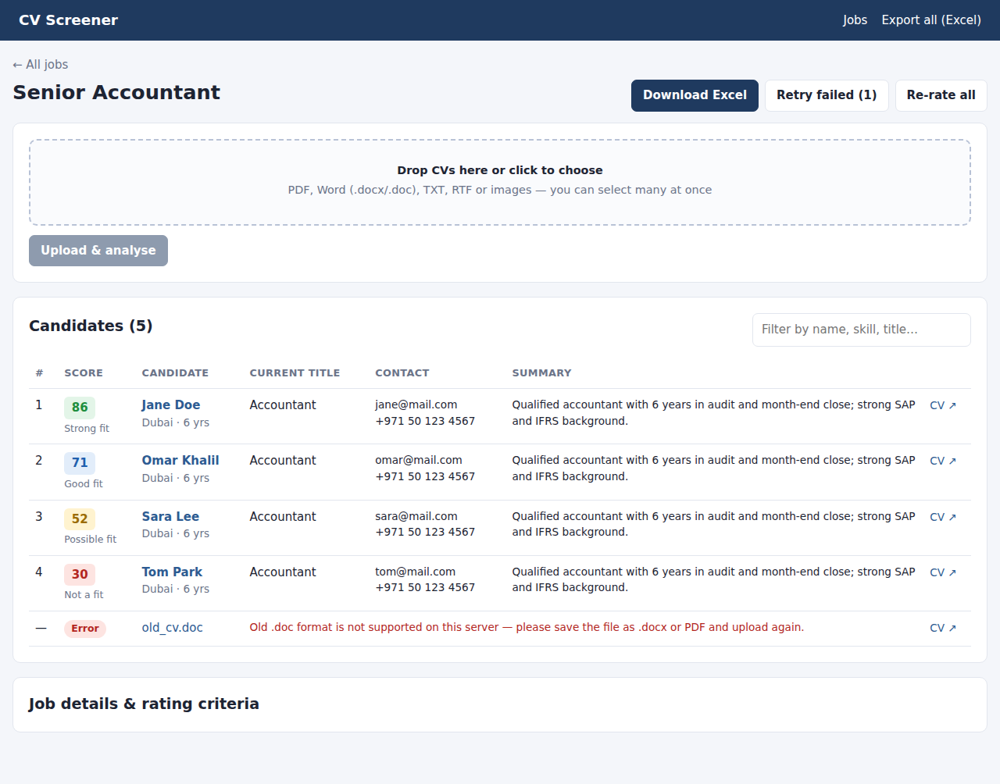
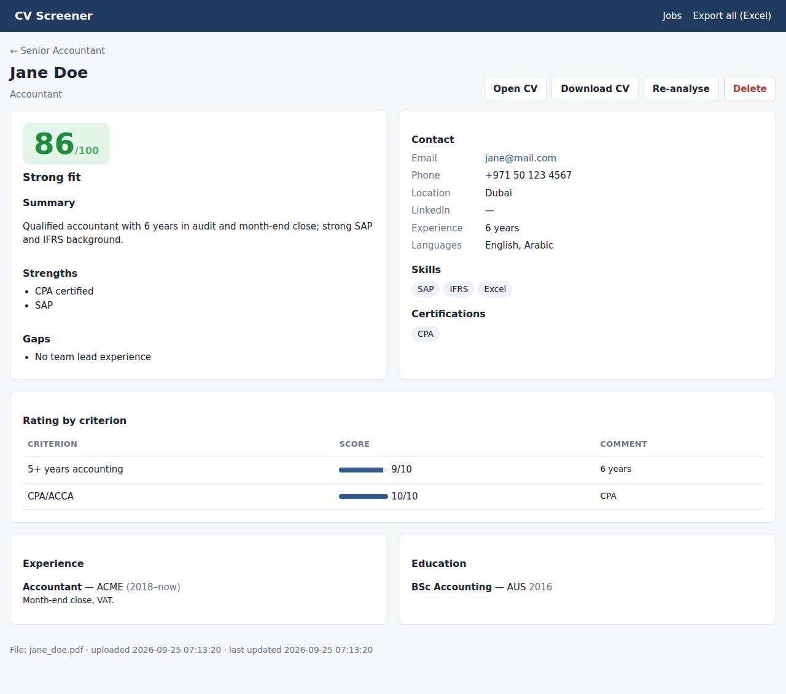

# CV Screener: a simple AI applicant tracking system (ATS)

Upload CVs (PDF, Word, text or images). The app reads each CV, pulls out the candidate's details, writes a short summary and rates the candidate against the job criteria you set. You can download everything as an Excel sheet, ranked by score.





## Features

- **Jobs**: create a job with a description and a "What I want" box for your own rating criteria (must-haves, nice-to-haves, location, languages and so on).
- **Bulk upload**: drag and drop many CVs at once. Supported types: `.pdf`, `.docx`, `.doc`*, `.txt`, `.rtf`, `.png`, `.jpg` and `.webp`. Scanned PDFs work too.
- **Automatic extraction**: pulls out the name, email, phone, location, LinkedIn, current title, years of experience, education, work history, skills, languages and certifications.
- **Rating**: gives an overall score from 0 to 100 and a recommendation: *Strong fit*, *Good fit*, *Possible fit* or *Not a fit*. Each of your criteria gets its own score out of 10 with a comment, plus a list of strengths and gaps.
- **Excel export**: a ranked, colour-coded workbook for each job (with a second sheet of per-criterion scores), or one workbook with every job.
- **Re-rate**: change the criteria and re-score every candidate with one click.
- **Password login** and a downloadable copy of each original CV.

\* Old `.doc` files need `antiword` on the server (see Railway step 4). Otherwise, save the file as `.docx` or PDF.

The AI part uses the Claude API. By default it uses the `claude-opus-5` model.

## Run it locally

```bash
cd cv-ats
python -m venv venv
source venv/bin/activate          # Windows: venv\Scripts\activate
pip install -r requirements.txt

export ANTHROPIC_API_KEY=sk-ant-...     # Windows: set ANTHROPIC_API_KEY=sk-ant-...
export APP_PASSWORD=mypassword
python app.py
```

Then open http://localhost:5000.

## Deploy on Railway

1. Push this repository to GitHub.
2. In Railway, go to **New Project → Deploy from GitHub repo** and pick this repo.
3. Open the service's **Settings**, set **Root Directory** to `/cv-ats`, and save.
4. Under **Variables**, add these:

   | Variable | Value |
   |---|---|
   | `ANTHROPIC_API_KEY` | your key from https://console.anthropic.com |
   | `APP_PASSWORD` | the password you'll use to log in |
   | `SECRET_KEY` | any long random string |
   | `DATA_DIR` | `/data` |
   | `RAILPACK_DEPLOY_APT_PACKAGES` | `antiword` *(optional, adds `.doc` support)* |

5. **Add a volume** so your data survives redeploys. Right-click the service, choose **Attach Volume**, and set the mount path to `/data`.
6. Under **Settings → Networking**, click **Generate Domain**, then open the URL.

`railway.json` already sets the start command and the health check (`/health`).

### Optional settings

| Variable | Default | Meaning |
|---|---|---|
| `AI_MODEL` | `claude-opus-5` | The Claude model to use. `claude-sonnet-5` is cheaper. |
| `AI_EFFORT` | `high` | `low` / `medium` / `high` / `xhigh` / `max`. Lower is faster and cheaper. |
| `MAX_WORKERS` | `3` | How many CVs are analysed at the same time |
| `MAX_UPLOAD_MB` | `100` | Maximum size of one upload batch |

## How it works

```
upload ──► saved to DATA_DIR/uploads ──► background queue (worker.py)
                                             │
             extractor.py: PDF/image sent as-is, Word/TXT converted to text
                                             │
             analyzer.py: Claude returns structured JSON (details + scores)
                                             │
                          SQLite (DATA_DIR/ats.db) ──► web UI / Excel export
```

| File | Purpose |
|---|---|
| `app.py` | Flask web app (routes, login, upload, export) |
| `analyzer.py` | The Claude prompt and the structured output schema. Edit the prompt here to change how candidates are judged. |
| `extractor.py` | Reads each file type |
| `worker.py` | Background processing queue |
| `excel.py` | Builds the Excel workbook |
| `db.py` | SQLite storage |

## Privacy

CVs contain personal data. Uploaded files and the database are stored only in `DATA_DIR`, which is git-ignored. Always set `APP_PASSWORD` when the app is online. The rating prompt tells the model to ignore protected characteristics such as age, gender and religion. Even so, treat scores as a screening aid and not as the final decision.
